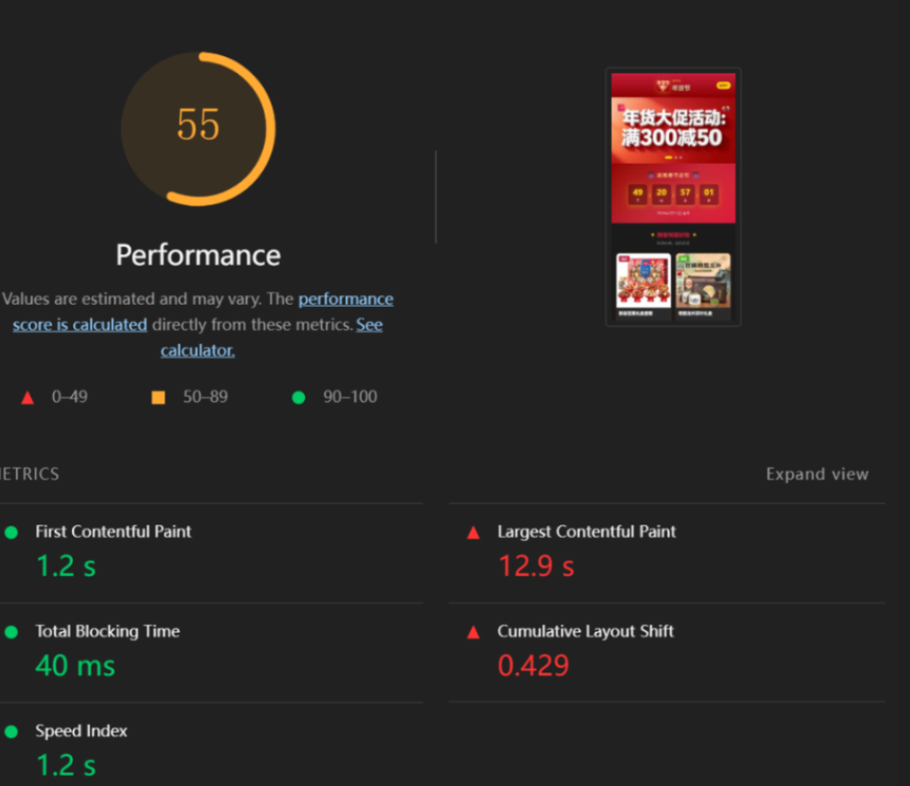

# 2026 年货节：极致性能 H5 促销单页实战

[](#性能表现对比)
[](#技术栈)
[](https://opensource.org/licenses/MIT)

**项目背景：** 本项目是一个为 2026 年货节打造的移动端促销 H5 页面。核心目标是在“无构建工具（No-Build）”的约束下，通过原生浏览器特性与底层渲染优化，解决巨型资源加载导致的阻塞问题，打造极致的丝滑体验。

---

## 在线演示与视频

| 类别 | 访问入口 | 说明 |
| :--- | :--- | :--- |
| **在线预览** | [点击进入 GitHub Pages](https://daphne502.github.io/Native-Speed-Mall/) | 直接进入移动端促销 H5 页面 |
| **视频演示** | [](https://www.bilibili.com/video/BV1GGvUBGEPg/?spm_id_from=333.337.search-card.all.click) | 包含No Throttling网络下和 3G (模拟弱网)网络条件下性能对比及交互演示 |

---

## 性能表现对比

针对首屏资源抢占、图片体积过大以及布局抖动（CLS）等痛点，经过三阶段优化，数据提升如下：

| 指标 (Mobile 设备) | 优化前 (Baseline) | 优化后 (Optimized) | 优化效果 |
| :--- | :--- | :--- | :--- |
| **Lighthouse 总分** | 75 | **98** | **↑ 提升明显** |
| **LCP (最大内容渲染)** | **24.4 s** | **1.6 s** | **↓ 提速 15 倍** |
| **FCP (首次内容渲染)** | 1.2 s | 1.6 s | (引入 Critical CSS 的正常开销) |
| **CLS (累积布局偏移)** | ==0.429== | **0** | **100% 解决页面跳动** |
| **资源总体积** | 5.2 MB | **~800 KB** | **↓ 压缩 85% 以上** |

**有关 CLS (==0.429==)特此说明:**
CLS (累积布局偏移) 评分异常 (0.429) 是在实际项目优化过程中出现的问题,当时Lighthouse 总分结果一度低至55分,后续通过`aspect-ratio` ,配合 `object-fit` 成功解决.详情可见[process-problem-solving.md](./process-problem-solving.md)



---

## 核心优化手段

### 1. 关键渲染路径 (CRP) 极致压缩

* **Critical CSS 内联：** 提取首屏（Header 和 Banner）必须的 CSS 直接写入 HTML `<style>` 标签。
* **非关键 CSS 异步加载：** 利用 `link rel="preload"` 异步加载 `style.min.css`，彻底解除 CSS 对 DOM 解析的渲染阻塞。

### 2. 现代图片加载与分发策略

* **AVIF 格式转变：** 使用 Squoosh 工具对 Hero Banner 进行极致压缩，将 3MB+ 的 PNG 转为 **AVIF** 格式（质量 50-60），体积骤降至 **200KB** 以内。
* **响应式图片 (`<picture>`)：** 针对 375px 和 640px 屏幕分发不同尺寸的 AVIF 资源，配合 `fetchpriority="high"` 确保 LCP 资源抢占最高下载带宽。
* **智能按需加载：** 对所有非首屏图片开启 `loading="lazy"` 和 `decoding="async"`。

### 3. 布局稳定性治理 (Zero CLS)

* **容器占位策略：** 针对动态图片加载引起的页面抖动，使用 CSS 现代属性 `aspect-ratio` (375/200) 为图片预留空间，确保在图片下载完成前布局不发生偏移。

### 4. 无构建流架构 (No-Build)

* **原生 ESM：** 采用原生 `type="module"` 引入脚本，利用浏览器原生的依赖管理能力。
* **脚本非阻塞：** 使用 `defer` 属性确保 JS 在 HTML 解析完成后执行，降低 TBT（总阻塞时间）。

---

## 过程性难题解决 (Technical Challenges)

### Q1：CSS 标准属性兼容性与警告消除

在实现商品名称的两行文本截断时，VS Code 提示需定义标准属性以保证长效兼容。

* **Solution：** 在保留 `-webkit-line-clamp` 的同时，补齐标准属性 `line-clamp: 2;`。

### Q2：LCP 发现延迟与网络拥塞

Lighthouse 早期报告 LCP 高达 24.4s，分析发现是由于 3.1MB 的非首屏 PNG 图片抢占了 HTTP 并发连接数。

* **Solution：**
    1. **优先级劫持：** 在 `<head>` 声明 `preload` 预加载 Banner，使浏览器在解析 DOM 前就开始下载核心资源。
    2. **资源瘦身：** 强制将个别商品大图转为 AVIF，保证单张资源体积最高不超过 900KB（实测最大 878KB）。

### Q3：交互性能的权衡

在不使用外部库的情况下，处理滚动（Scroll）事件导致的性能损耗。

* **Solution：** 手写 `Throttle`（节流）函数，对“返回顶部”按钮的显示逻辑进行高频事件优化，确保主线程在滚动时不发生掉帧。

### Qx：更多过程性问题详见 [process-problem-solving.md](./process-problem-solving.md)

---

## 技术栈

* **核心语言：** HTML5, CSS3 (Custom Properties, aspect-ratio), JavaScript (ES6+).
* **模块化方案：** Native ES Modules.
* **优化工具：** Squoosh (AVIF 压缩), Lighthouse (性能审计), VS Code Live Server.

---

## 如何在本地运行

由于本项目使用了 **原生 ES Modules**，直接通过文件系统打开（`file://`）会触发 CORS 策略限制，请按以下步骤操作：

1. 克隆仓库：

    ```bash
    git clone [https://github.com/daphne502/Native-Speed-Mall.git](https://github.com/daphne502/Native-Speed-Mall.git)
    ```

2. 进入目录并运行静态服务器：
    * **VS Code：** 安装并点击右下角 `Go Live` (Live Server)。
    * **Python：** `python -m http.server 8000`
    * **Node.js：** `npx serve .`

---

**结语：** 本项目开展了一场关于 **“如何在有限的资源下压榨出最高性能”** 的实验。它证明了我目前对浏览器底层渲染机制的几乎全部理解。
